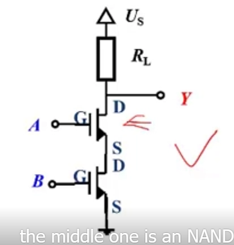

# Principles of Electric Circuits

## L01 Why should I learn the course?

### 0. Some considerations on the course

- I've learned in my middle school. ^_^
- What's the relationship between this course and others in my curriculum?
- Does this course related to my life?

### 1. Yes. You can sovle this

  

But how about these?

  

### 2. Difference

- Elements
  - Resistor, inductor, capacitor, diode, MOSFET, Op Amp, ...
  - 电阻，电感，电容，二极管，MOSFET, 运算放大器，...
- Analysis
  - Node, loop, superposition, Thevenin, ...
  - 节点法，回路法，叠加法，戴维南法，...
- Concepts
  - Port, dual, Q-point, zero state, ...
  - 端口，对偶，静态工作点，零状态，...
- Perspectives
  - Engineering, equivalent, abstracting, ...
  - 工程，等效，抽象，...

### 3. EE course infrastructure

  

### 4. Circuits 电路的四大特征

- The composition of several basic elements;
- With the function of energy process and signal process;
- Can be analyzed systematically;
- Can be designed with new function;

substracting circuit:

  

NAND gate circuit:

  

Buck chopper circuit: 降压斩波器电路

  

### 5. Will this course be dull?

Absolutely no!

  

  

