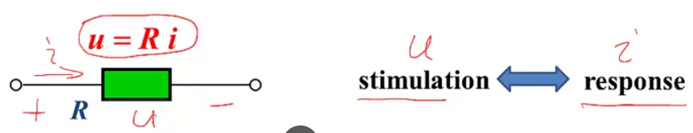
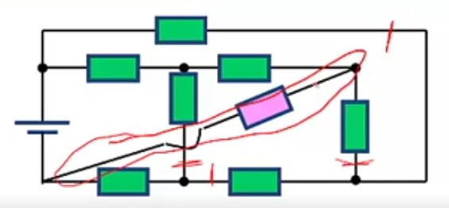

# Principles of Electric Circuits

## L02 Some concepts on circuits

### 1. Composition

- Source (generator, pv cell, mic, ...)
- Load (motor, speaker, screen, ...)
- Energy or/and signal processing circuits (transformer, filter, amplifire, ...)
- Switch and line (circuits board, transmission line)

#### How to regard circuits?

1. by Load 负载

   - Resistive 阻性电路: If the load of circuits only consists of resistors
   - Dynamic 动态电路: If the circuit contains capacitors(and/or inductors)

   for Dynamic Load:

   - Transient 暂态分析: If we're interested in the change of voltages and currents in the transient process of the dynamic circuits
   - Steady state 稳态分析：If we're interested in the value before and after the changing process

2. by Source

    - dc
    - ac
      - sine
      - periodical

### 2. Model

#### (1) Ideal circuit elements

Actual circuit elements $\xRightarrow{abstracting}$ simple $u-i$ relationship

Basic ideal circuit elements (two terminal):

  

#### (2) Circuit modeling

  

### 3. Classification

#### (1) Linear and nonlinear

  

Linear elements: linear relationship of stimulation and its corresponding response

$u = Ri$

$$
\begin{cases}
u\rightarrow ku & \implies i = \frac{ku}{R} = k \frac{u}{R} & homogeneity \\
u\rightarrow u_1 + u_2 & \implies i = \frac{u_1+u_2}{R} = \frac{u_1}{R} + \frac{u_2}{R} & additivity 
\end{cases}
$$

Linear circuits: all loads are linear, expressed by linear equations.

Nonlinear circuits: one or more load are nonlinear, expressed by nonlinear equations.

#### (2) Planar and non-planar 平面电路与非平面电路

Planar circuits can be draw on a plane without any intersection of elements.

  

Non-planar circuits will always have intersection(s).

  
