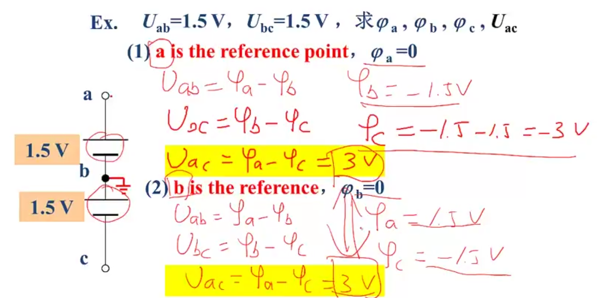

# Principles of Electric Circuits

## L03 Variables

### 1. Current

Time variance rate of charges.

$$
i(t) \xlongequal{def} \lim_{\Delta t \rightarrow 0} \frac{\Delta q}{\Delta t} = \frac{dq}{dt}
$$

  

For any two-terminal element, current is positive charges from A to B in unit time.

Unit: A(ampere) (Ampere: 1775-1836, France)

- dc: Direct Current, i.e. Ideal dc current $I$
- ac: Alternating Current, i.e. Sinusoidal accurrent $i(t)$

### 2. Voltage

The work provided by electric field force while moving unit positive charge.

$$
u_{AB} = \frac{dW_{AB}}{dq}
$$

Unit: V(Volt) (Volt: 1745-1827, Italian)

$$
u_{BA} = \frac{dW_{BA}}{dq} = \frac{-dW_{AB}}{dq} = -u_{AB}
$$

### 3. Potential 电位

The voltage from some point to the reference point

The potential of the reference point is *ZERO*.

Symbol: $\varphi$ or $U$ 

Unit: V(Volt)

  

If $c$ is appointed as the reference point, $\varphi_c=0$, then:

$$
\varphi_{a} = U_{ac}, \varphi_b = U_{bc}, \varphi_d = U_{dc}
$$

We know:

1. There is a `voltage` between any two points;
2. The `potential` of some point is its voltage toward the reference point.

  

$$
\begin{align}
\varphi_a &= U_{ac} \\
\varphi_b &= U_{bc} \\
U_{ac} &= U_{ab} + U_{bc} \implies \\
U_{ab} &= U_{ac} - U_{bc} = \varphi_a - \varphi_b
\end{align}
$$

The voltate between two points = the difference of the two potential of these two points.

$$
\begin{align}
Drop of potential &\longrightarrow Voltage \longrightarrow Drop of voltage \\
电位降 &\longrightarrow 电压 \longrightarrow 电压降
\end{align}
$$

  

The voltage between two points has no relationship to the selection of the reference point.

### 4. Electromotive force 电动势

The work proviced by `non-electric field force` while moving unit positive charge.

$$
e_{BA} = \frac{dW_{BA}}{dq}
$$

Unit: V(Volt)

  

- $e_{BA}$, increase of potential $e_{BA} = \varphi_A - \varphi_B$
- $u_{AB}$, decrease of potential $u_{AB} = \varphi_A - \varphi_B$

$e_{BA} = u_{AB}$

### 5. Capital and small letter for variables

- Capital for constant variables, like $U,I$
- Small for changeable variables, like $u,i$

