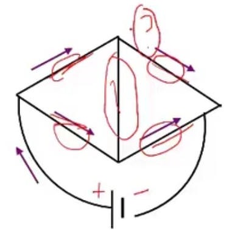
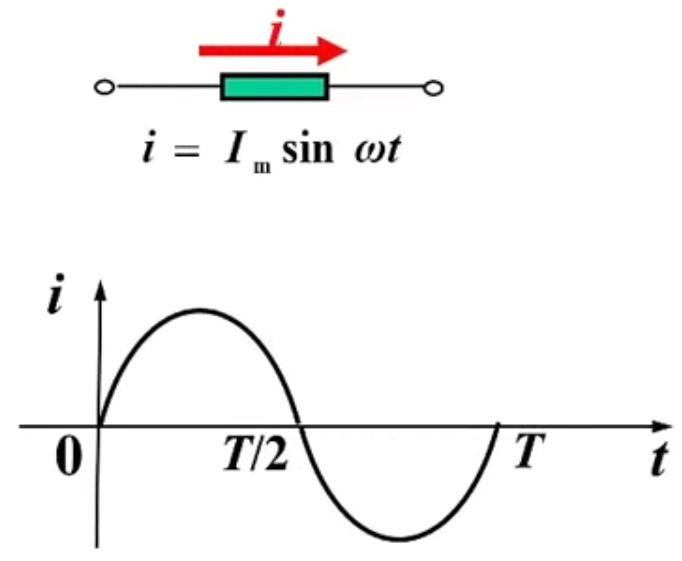
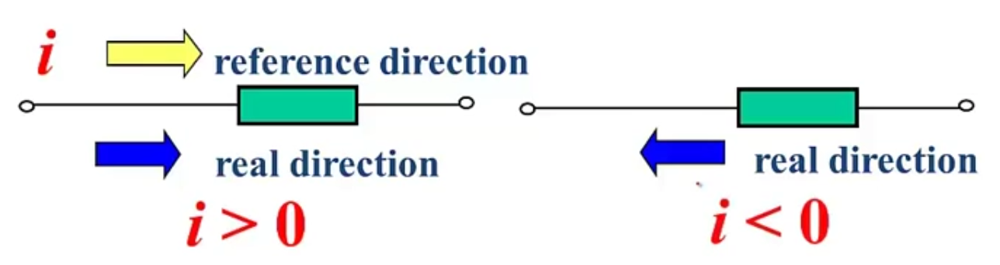
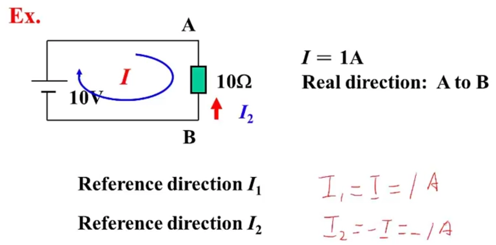
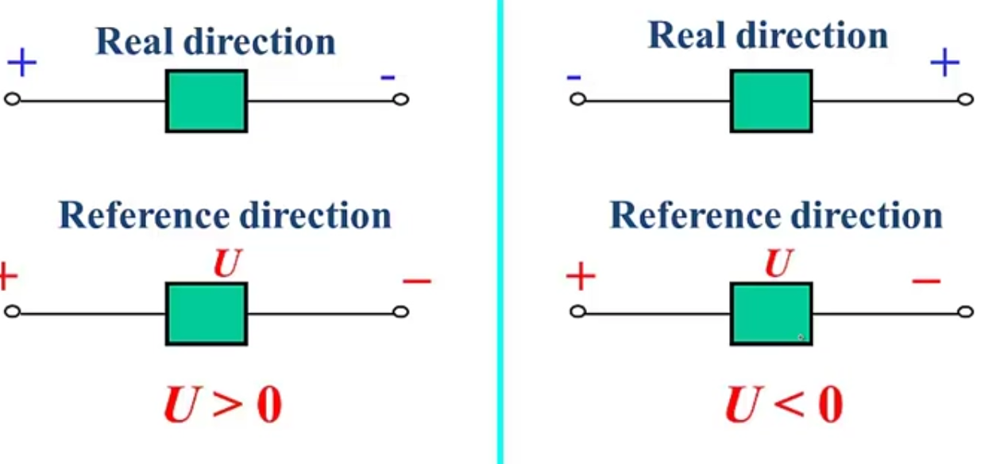
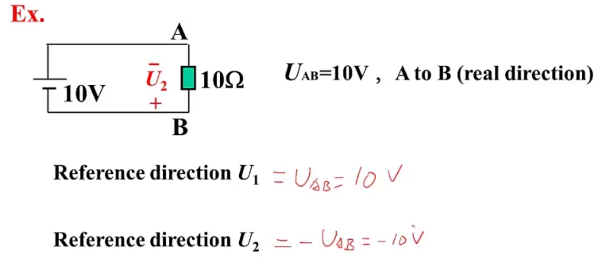
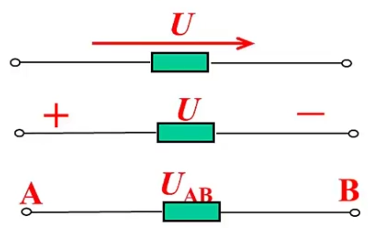
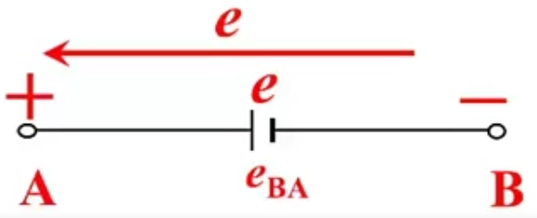
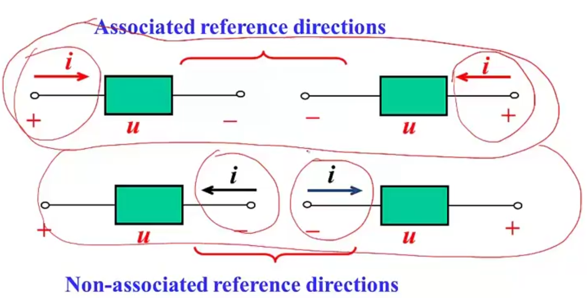

# Principles of Electric Circuits

## L04 Reference direction

### 1. Why?

  

  

- Reason a: the real direction of the current or the voltage cannot be determined.
- Reason b: the direction of the voltate or current is changed with time

### 2. Reference direction of current

  

Two ways for representing reference direction of currents:

1. Arrow
2. Double subscript ($i_{AB}$): reference direction from A to B

  

### 3. Reference direction of voltages

  

  

Three ways for representing reference direction of voltages

1. Arrow
2. Positive and negative
3. Double subscript

  

Three ways for electromotive force:

  

### 4. Current Voltage reference direction

  
